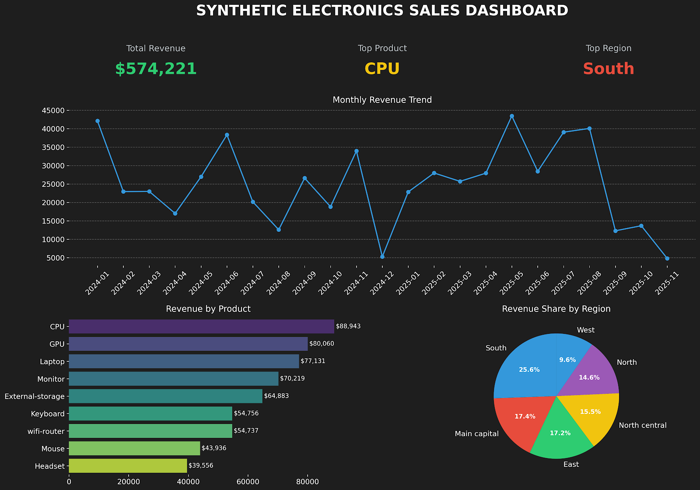

# Excel: Synthetic Data Generation & Dynamic Dashboards

## Overview
This project demonstrates end-to-end data manipulation in Excel[cite: 13], focusing on two core competencies:
1. **Procedural Data Generation:** Constructing a realistic, synthetic dataset from scratch[cite: 13].
2. **Automated Reporting:** Building a dynamic dashboard architecture that automatically updates when new data is ingested[cite: 13].

## Project Workflow
1. **Data Generation:** Developed a 200-row transactional sales report for a fictional electronics retailer[cite: 13]. Leveraged Excel functions such as `=RANDBETWEEN()`, `=CHOOSE()`, and `=DATE()` to randomly populate constraints for `Date`, `Product`, `Region`, and `Units Sold`[cite: 13].
2. **Data Modeling & Analysis:** Structured the raw data as a dynamic Excel Table and utilized Pivot Tables for categorical aggregation[cite: 13].
3. **Dashboard Architecture:** Designed a front-end dashboard linked directly to the Pivot Tables[cite: 13]. Because the underlying data is housed in a defined Excel Table, the entire dashboard updates dynamically via the "Refresh All" command when new rows are added[cite: 13].

## Key Insights (Synthetic Data)
* **Top Performing Product:** CPU
* **Highest Revenue Region:** South

## Technical Skills Applied
* **Microsoft Excel**
* **Procedural Functions:** `RANDBETWEEN`, `CHOOSE`[cite: 13]
* **Data Modeling:** Excel Tables (Dynamic Ranges)[cite: 13]
* **Aggregation:** Pivot Tables & PivotCharts[cite: 13]
* **Reporting:** Dynamic Dashboards ("Refresh All" automation)[cite: 13]
